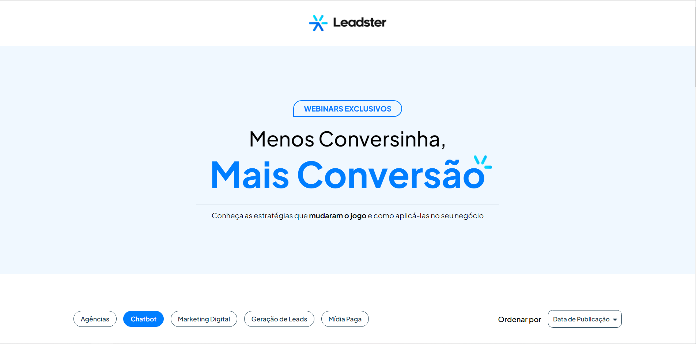
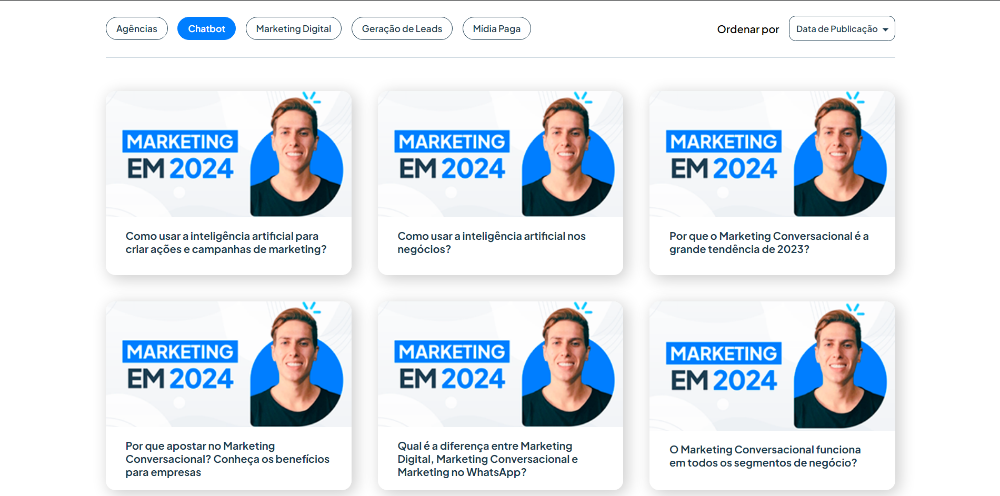
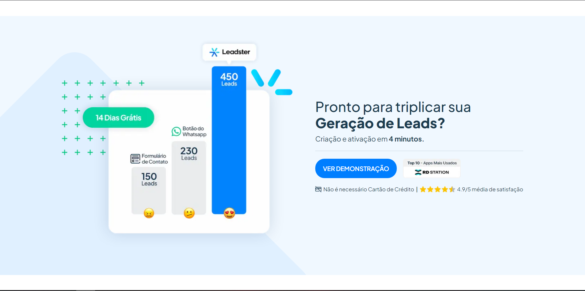
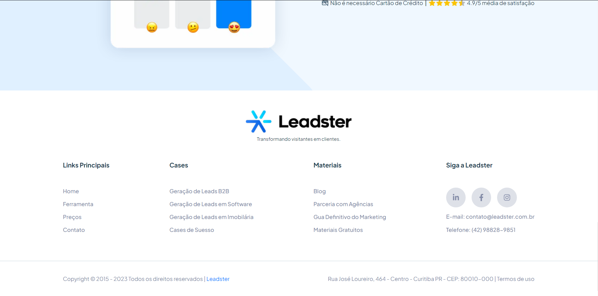
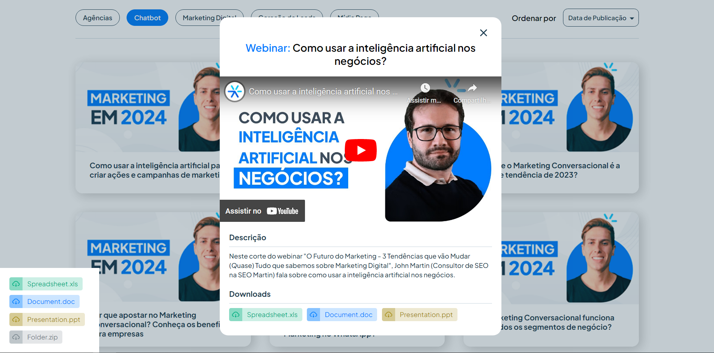

<h1 align="center">🚀 Teste Leadster</h1>


<h2>✅ Instalando dependências</h2>

Após clonar o repositório, é preciso instalar as dependências:

## Instalando

```bash
npm install
# ou
yarn install
```

Em seguida executamos o projeto:

## Executando o projeto

```bash
npm run dev
# ou
yarn dev
```

<h1>Ferramentas Utilizadas</h1>

<ul>
  <li>NextJS</li>
  <li>ReactJS</li>
  <li>Typescript</li>
  <li>Styled Components</li>
  <li>React Icons</li>
</ul>

<h1>Organização do Projeto</h1>

<p>O projeto foi organizado de forma estratégica pensando na aplicação como um todo. Se tratando de uma Landing Page, temos um website onde todo o conteúdo se localiza na página principal. Partindo desse princípio, dividi a organização do projeto de uma forma intuitiva e simplificada pensando na utilização e manutenção do projeto por outros desenvolvedores.</p>

Dentro da pasta `src` encontram-se as pastas `components`, `sectionsPage` e `shared`:

<ul>
  <li>
    <h2>components</h2>
    <p>
      Dentro de "components" encontramos pequenos itens que se repetem ou que podem se repetir ao longo do projeto e são separados e escritos de forma que possam ser reutilizados
    </p>

  </li>
  <li>
    <h2>sectionsPage</h2>
    <p>Pensando justamente na composição de uma landing page que constitui-se de diferentes seções com demais conteúdos. O projeto foi pensado desde o início em seguir as práticas de SEO, meta tags, boas práticas de escrita de código e acessiblidade, além de fazer uso da performance fornecida pelo NextJS.</p>
    <p>A organização das seções foi pensada em três partes principais: header, main e footer. E dentro de cada um desses componentes principais, foi adicionado demais componentes, elementos e seções pertencentes à cada um desses três elementos majoritários.</p>

  </li>
  <li>
    <h2>shared</h2>
    <p>Dentro de "shared" temos os conteúdos globais ao projeto e demais serviços. Dentro desse item alocamos os estilos globais ao projeto e um tema personalizado de acordo com o padrão de cores e fontes escolhidas para o projeto. Permitindo assim a padronização do projeto, assim como possíveis manutenções e alterações na aparência do projeto como um todo. </p>
    <p>Dentro de "shared", além dos estilos, temas e serviços, também adicionamos efeitos de animações padrões que possam ser reutilizadas nos demais elementos html com muita praticidade.</p>

  </li>
</ul>

<h1>Preview do projeto</h1>

Header e Lead section


Media section


Comparative section


Footer


Modal player section

